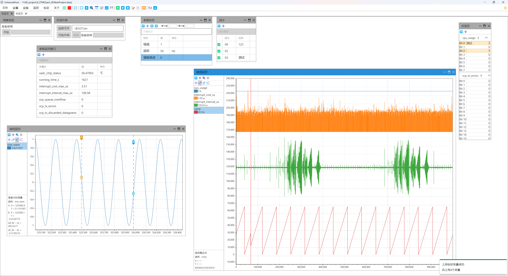

# UniversalHost

基于 XCP 协议和自定义 IAP 协议的通用上位机工具。

> 项目目前处于早期开发阶段，功能和接口可能会发生变化。

## 项目简介

UniversalHost 是面向嵌入式设备开发与调试的通用桌面上位机，集成实时数据监控、参数标定、故障录波上传和在线固件升级。通过 XCP 协议与 ELF 符号信息访问设备变量，通过自定义 IAP 协议完成固件升级，适用于日常调试、性能验证和设备维护。

## 特性

- **灵活的通信方式**：支持 UDP 和串口传输。全双工串口支持 XCP 数据监控、参数标定及 IAP 在线升级；半双工串口支持 IAP 在线升级。
- **高吞吐采集与大容量曲线显示**：实测以 10 kHz 采样率采集每次 256 字节的数据不丢帧，同时流畅绘制 32 条曲线，每条曲线保留 100 万点历史数据。曲线采用环形缓冲区和多级极值索引，缩小视图时保留尖峰，放大后可查看原始采样点。
- **基于符号的监控与标定**：从 ELF 文件读取变量符号信息，通过 XCP 协议完成数据采集与参数读写。设备已实现相应 XCP 功能时，增删监控或标定变量无需修改下位机通信代码；支持配置变量别名、单位和描述。
- **多种数据观察方式**：提供曲线、表格和位监控视图，支持曲线缩放、坐标轴自动适应、最近采样点查询及双光标差值测量，便于观察波形、核对数值和排查状态位。
- **通用在线升级流程**：基于自定义 IAP 协议完成固件传输、擦除、写入、校验和重启确认，支持超时重试与取消升级。设备端实现对应协议后，可用于 STM32、Zynq、TI DSP 等平台。
- **可保存的调试工程**：统一保存通信设置、变量配置、窗口布局和窗口上下文，支持恢复调试工作区。ELF 与固件文件支持相对工程目录的路径，便于整体移动工程目录。

## 截图



## 主要功能

- 设备通信：通过 UDP 或串口连接设备，统一管理 XCP 与 IAP 通信会话。
- 变量管理：加载 ELF 符号信息，配置监控与标定变量及其显示属性。
- 实时监控：采集设备数据，以曲线、表格或位状态展示。
- 参数标定：读取与写入设备变量，保存标定参数。
- 故障录波：上传设备故障录波数据并保存为 CSV 文件。
- 固件升级：加载 BIN 文件，执行自定义 IAP 在线升级流程。
- 工程管理：保存与恢复工程设置、Dock 窗口布局及窗口上下文。

## 开发环境

- .NET 10
- C#

## 快速开始

1. 克隆仓库：

   ```bash
   git clone https://github.com/yourusername/UniversalHost.git
   cd UniversalHost
   ```

2. 运行 `dotnet publish UniversalHost/UniversalHost.csproj -c Release` 编译发布。

   发布时自动将 `docs/使用说明.md` 和 `docs/快捷键.md` 转换为 `使用说明.pdf` 和 `快捷键.pdf`，放在发布目录中，与可执行文件同级（包括单文件发布和 `--no-build` 发布）。构建机器需要 Python 3.10 或更高版本，以及 Microsoft Edge 或 Chrome；无需安装 Python 第三方包。发布后的程序不需要 Python 或浏览器。

   默认通过 `PATH` 中的 `python` 启动转换程序，自动查找浏览器。如需指定路径，可传入 `-p:ShortcutsPdfPython="C:/Python/python.exe"` 和 `-p:ShortcutsPdfBrowser="C:/Program Files (x86)/Microsoft/Edge/Application/msedge.exe"`，这两个设置同时适用于两份文档。找不到浏览器时提示警告并跳过 PDF 生成，发布继续；其他转换错误仍会使发布失败。

   也可以单独生成：

   ```powershell
   python tools/publish_shortcuts.py docs/快捷键.md UniversalHost/bin/Publish/快捷键.pdf
   python tools/publish_shortcuts.py docs/使用说明.md UniversalHost/bin/Publish/使用说明.pdf
   ```
   
3. 运行。


串口固件升级前须先断开 XCP 设备连接，升级及清理期间不能重新连接；可用“取消”结束升级会话。接收超时作为设备处理与调度裕量，程序另计线上传输时间。设备端须实现 [传输层约定.md](docs/传输层约定.md) 中的 COBS 封装。串口 DAQ 采样率由设备设定，应按全部 ODT 线上字节数预留带宽裕量，启动监控时日志会给出当前布局的带宽估算。

## TODO

- 实现监控时保存数据，保存为HDF5。
- IAP 增加目标设备固件合法性检查，避免选择错误 BIN。
- 日志显示。
- 远程控制。

项目目录结构会随着功能开发持续调整。

## 协议说明

### XCP

XCP（Universal Measurement and Calibration Protocol）是一种用于测量、标定和控制的标准协议。项目将根据实际通信传输层逐步实现相关功能。

### 自定义 IAP

自定义 IAP 协议用于设备固件升级及相关控制操作，具体数据格式和命令定义以项目实现及设备协议文档为准。

面向操作人员的完整使用流程见 [使用说明.md](docs/使用说明.md)，键鼠操作见 [快捷键.md](docs/快捷键.md)。协议说明也集中在 `docs/`：UDP 与串口通信规则见 [传输层约定.md](docs/传输层约定.md)，IAP 定义见 [IAP协议.md](docs/IAP协议.md)，故障录波格式见 [故障录波结构体定义.md](docs/故障录波结构体定义.md)。

## 许可证

采用 MIT 许可证。
